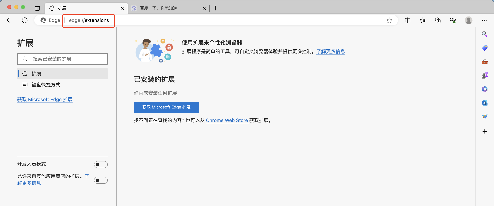
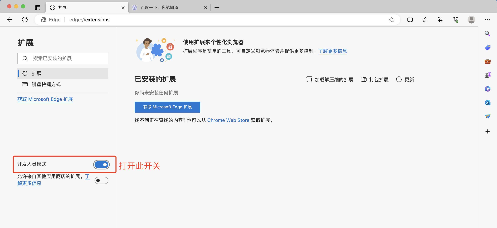
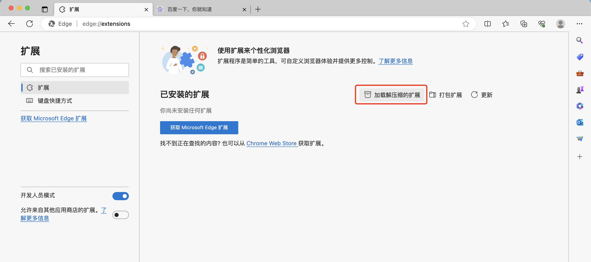

Edge浏览器安装Samepage插件
1. 打开浏览器插件页面
复制链接 **edge://extensions/** 至浏览器输入框打开

2. 打开开发人员模式

3. 点击[下载插件ZIP](https://github.com/MLT-OSS/samepage/releases)，解压插件ZIP压缩包至文件夹
4. 点击加载解压缩的扩展；在弹出的文件夹选择页面选择【第三步】的文件夹

5. 刷新需要使用插件页面或重新打开 tab 后插件（新包）生效;

